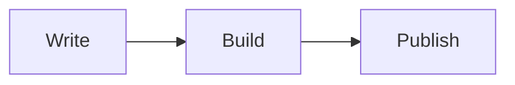

# astro-theme-ink 墨

[English](./README.md) · [简体中文](./README.zh-CN.md)

A warm, paper-feel personal blog theme built with [Astro](https://astro.build) and [UnoCSS](https://unocss.dev). It keeps the palette quiet, gives headings a serif voice, and leaves enough room for long-form writing to breathe.

The site is fully static. Build it once, then serve the generated files from any static host.

## Screenshots

<p>
  
  
</p>

<p>
  
  
</p>

<p>
  
  
  
</p>

## What is included

- Blog pages with pagination, yearly archives, RSS and sitemap
- A small, build-time search index searched in the browser; no third-party search service
- Light, dark and system themes, applied before first paint; warm ink and cool fresh palettes can be switched independently
- A configuration-driven home page with recent posts, education, skills, tag cloud and friend-link sections
- Sticky desktop table of contents, mobile table of contents, reading progress, reading-time estimates, and previous/next links
- Responsive local cover images, lazy-loaded article images, and click-to-zoom image viewing
- Markdown extras: KaTeX math, Mermaid diagrams, Shiki highlighting, line highlights/diffs, code titles, copy buttons and automatic folding after 15 lines
- Optional Waline comments, per-post page views and a footer-wide visit counter
- Canonical URLs, Open Graph and Twitter metadata, JSON-LD BlogPosting data, RSS full text and sitemap generation

## Requirements

- Node.js 22.12.0 or newer (required by Astro 7)
- pnpm; this repository is pinned to pnpm 10.20.0

## Run it locally

```bash
pnpm install
pnpm dev
```

The development server listens on <http://localhost:4321> by default.

For the day-to-day blogging and release workflow, see the [detailed blog guide](./docs/blog-guide.md). It explains the separation between a theme and a real blog, configuration, post URLs, captions, code and math, drafts, release checks and theme synchronization.

| Command                | Purpose                                                               |
| ---------------------- | --------------------------------------------------------------------- |
| `pnpm dev`             | Start the local development server                                    |
| `pnpm check`           | Run Astro and TypeScript diagnostics                                  |
| `pnpm build`           | Run diagnostics, then create the static site in `dist`                |
| `pnpm test`            | Run the Node regression suite                                         |
| `pnpm preview`         | Preview the built site locally                                        |
| `pnpm sync`            | Refresh Astro-generated types and content metadata                    |
| `pnpm format`          | Format the repository with Prettier; this command writes files        |
| `pnpm optimize:avatar` | Create `public/avatar.webp` from `public/avatar.png` (256 × 256 WebP) |

## Sync the theme into a blog

When the theme and the real blog live in separate repositories, always preview first and then apply the approved changes:

```powershell
cd D:/Code/astro-theme-ink
pnpm theme:sync --target ../Blog
pnpm theme:sync --target ../Blog --apply
```

The first command does not modify the blog. If you are already in the blog directory, explicitly name the theme source instead:

```powershell
pnpm theme:sync --source ../astro-theme-ink --target .
pnpm theme:sync --source ../astro-theme-ink --target . --apply
```

Run `pnpm test` and `pnpm build` in the blog after applying. Commit `.theme-sync.json` with the update. The script preserves posts, personal assets, domains and deployment settings; resolve `REVIEW` or `CONFLICT` results with the [sync guide](./docs/theme-sync.md).

For a local visual panel instead of the command line, run:

```powershell
pnpm theme:sync:ui
```

It opens `http://127.0.0.1:4175`, where you can set both directories, preview changes and explicitly apply them. The server listens only on the local machine. Use `--port 4300` to change the port or `--no-open` to print the address without opening a browser.

## Configure the site

Core site settings live in [src/site-config.ts](./src/site-config.ts). The file is typed, and most day-to-day changes belong there rather than in a component.

| Section          | Controls                                                                                       |
| ---------------- | ---------------------------------------------------------------------------------------------- |
| `site`           | Title, author, description, language, favicon, avatar, social image, default palette and theme |
| `header.menu`    | Header navigation                                                                              |
| `home`           | Hero content, recent-post count, education, skills, and optional tag/friend sections           |
| `footer`         | Copyright text, footer links and social links                                                  |
| `blog.pageSize`  | Number of posts per blog page                                                                  |
| `search.enabled` | Whether the search entry point and search UI are shown                                         |
| `pageview`       | Waline endpoint for article views and the optional site-wide counter                           |
| `comment`        | Waline endpoint for comments                                                                   |
| `friends`        | Items displayed on the `/links` page and, when enabled, on the home page                       |

Comments and counters are deliberately separate settings. Point both at the same Waline server if you want both features; leave either endpoint empty to disable that feature. Comments are loaded only when their section approaches the viewport.

The pages under [src/pages](./src/pages) and the prose on the About page remain normal Astro files, so they can be tailored without introducing a theme-specific configuration language.

`home.recentPosts` displays at most 5 posts; set it to `0` to hide the section. Footer quotes are on by default. Set `footer.showQuote` to `false` to hide them. Quotes are selected for the build date and rendered directly into HTML, without a client-side layout shift. They change only when the static site is rebuilt.

## Write a post

Add a Markdown file under [src/content/blog](./src/content/blog):

```markdown
---
title: 'Post title'
description: 'A concise summary for lists and metadata'
publishDate: 2026-08-17
updatedDate: 2026-08-18 # optional
language: 'English' # optional
heroImage: # optional local asset, relative to this file
  src: ../../assets/cover.png
  alt: 'Cover description'
draft: false # optional; hidden from lists and search, still reachable by URL
comment: true # optional; per-post comment switch
---

Write in Markdown.
```

Folder posts work too: a file at `src/content/blog/notes/index.md` is published at `/blog/notes` rather than `/blog/notes/index`.

Use a local relative asset for `heroImage` so Astro can generate responsive images at build time. Images in the Markdown body are lazy-loaded and can be opened in the built-in lightbox. For a standalone Markdown image, its `alt` text is also shown as the caption, so make it descriptive.

````markdown
Inline math: $E = mc^2$

$$
\int_0^1 x^2\,dx = \frac{1}{3}
$$


````

KaTeX is available on post pages. Mermaid is fetched and rendered in the browser only for a post that contains a Mermaid fence.

## Customize the look

- [src/assets/styles/tokens.css](./src/assets/styles/tokens.css): palettes, fonts, radii and other design tokens
- [uno.config.ts](./uno.config.ts): UnoCSS presets, theme mapping and typography
- [src/assets/styles/global.css](./src/assets/styles/global.css): global layout, code-block and motion rules
- [src/assets/styles/waline.css](./src/assets/styles/waline.css): Waline import and theme overrides

## Project layout

```
src/
├── site-config.ts        # typed site and home-page settings
├── content.config.ts     # blog collection schema
├── assets/styles/        # tokens and global/Waline styles
├── components/           # navigation, cards, TOC, comments and utilities
├── layouts/              # base and post layouts
├── pages/                # home, blog, archives, links, about, search, RSS
├── plugins/              # Markdown image and Shiki transforms
├── utils/                # URLs, collections, reading time and theme helpers
└── content/blog/         # Markdown posts
```

## Deploy

`pnpm build` produces a static `dist` directory. It can be deployed to GitHub Pages, Vercel, Netlify, Cloudflare Pages, or any host that serves static files.

The site URL and base path are read from the `SITE_URL` and `BASE_PATH` environment variables (see [astro.config.ts](./astro.config.ts)). The bundled GitHub Pages workflow sets both automatically. On other hosts, set `SITE_URL` to your production origin — it feeds the sitemap, canonical URLs, Open Graph URLs and RSS — and set `BASE_PATH` only when the site lives under a sub-path such as `/blog/`.

## Credits and license

The design takes inspiration from [astro-theme-pure](https://github.com/cworld1/astro-theme-pure) (Apache-2.0), while the theme itself is an independent implementation. The Shiki code-block pipeline in `src/plugins/shiki-custom-transformers.ts`, `src/plugins/shiki-official` and `public/icons/code.svg` is ported from that project under Apache-2.0. This repository is released under the [MIT License](./LICENSE).
