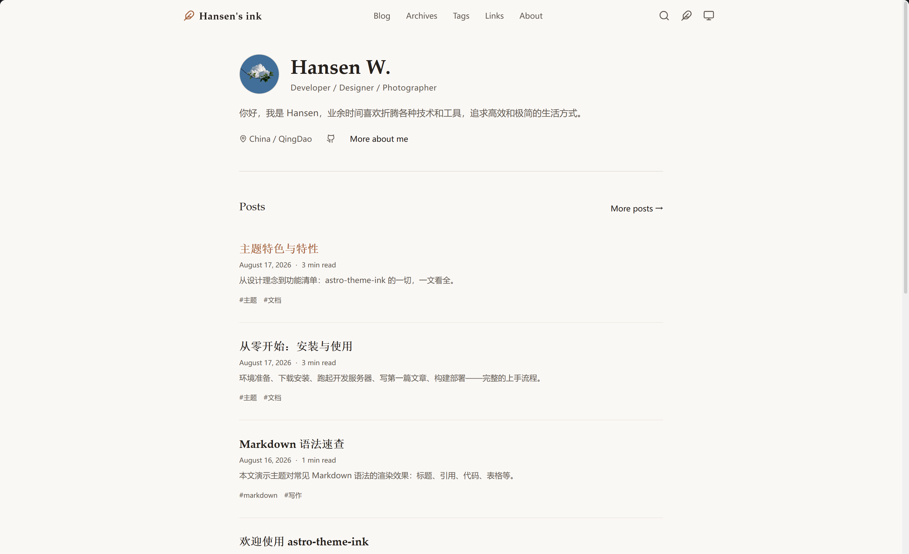
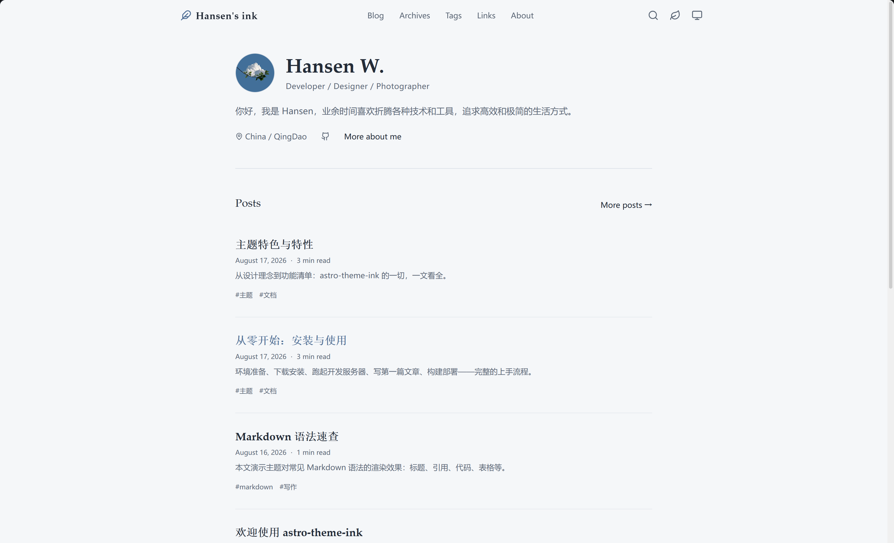
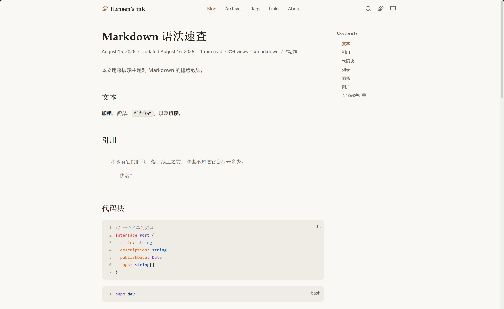
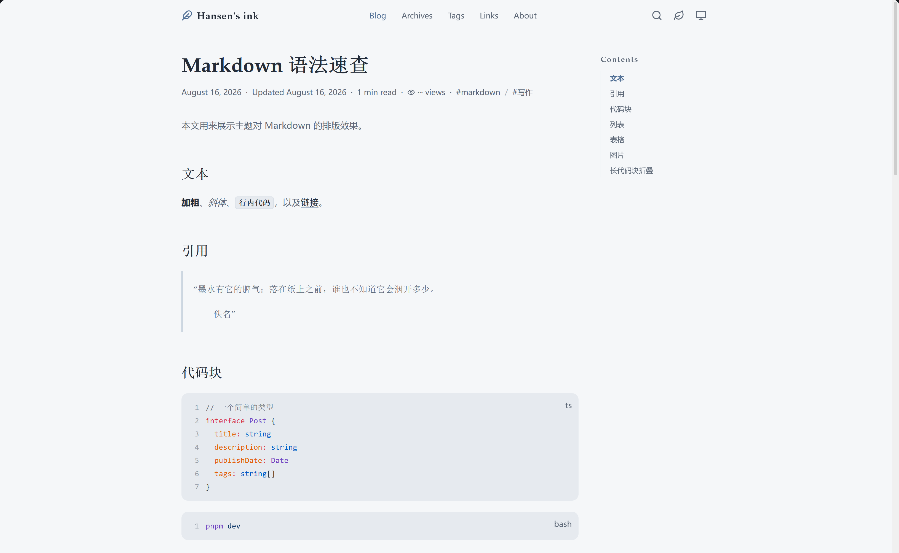
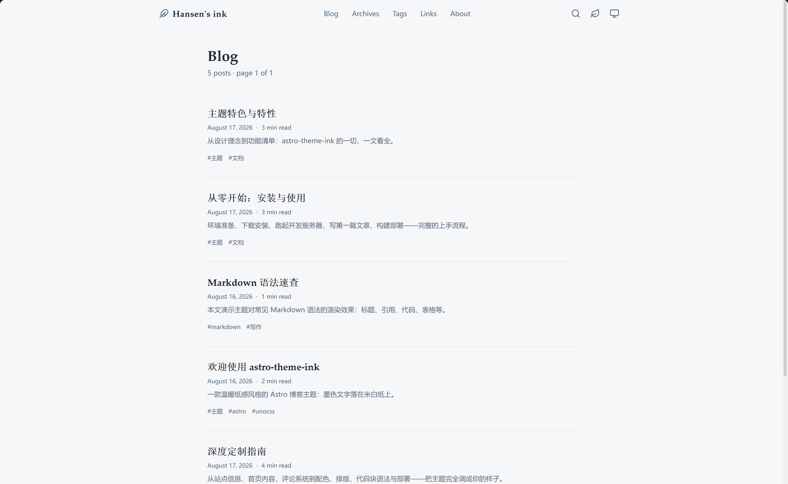
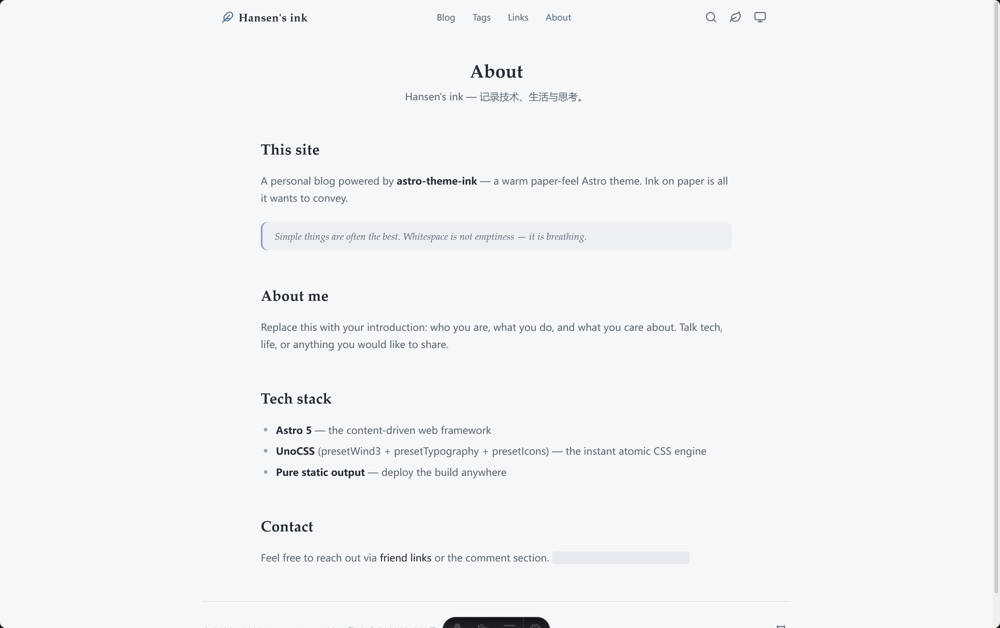
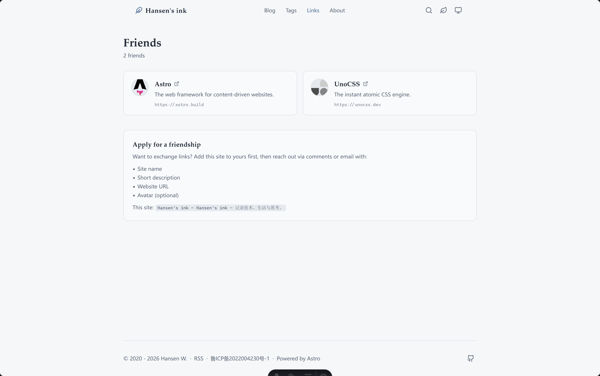

# astro-theme-ink 墨

[English](./README.md) · [简体中文](./README.zh-CN.md)

一款基于 [Astro](https://astro.build) 与 [UnoCSS](https://unocss.dev) 的个人博客主题。它把颜色收得很克制：暖纸色、灰阶和一个强调色；标题换成衬线字体，给长文留一点呼吸的地方。

项目只输出静态文件。构建完成后，任意能托管静态文件的平台都可以部署。

## 截图预览

<p>
  
  
</p>

<p>
  
  
</p>

<p>
  
  
  
</p>

## 已有的东西

- 博客列表、分页、标签、按年归档、RSS 和 sitemap
- 构建时生成轻量 JSON 索引，在浏览器内搜索；不依赖第三方搜索服务
- 亮色、暗色、跟随系统三种主题，首帧前完成设置；暖调 ink 与清爽 fresh 配色可独立切换
- 配置驱动的首页：最近文章、教育经历、技能、标签云和友链区都可以按需开关
- 桌面端吸顶目录、移动端折叠目录、阅读进度、阅读时长、上一篇 / 下一篇
- 响应式本地封面图、正文图片懒加载，以及点击放大查看
- Markdown 扩展：KaTeX 公式、Mermaid 图表、Shiki 高亮、行高亮 / diff、代码标题、复制按钮与超过 15 行自动折叠
- 可选的 Waline 评论、单篇阅读量和页脚全站访问量
- canonical、Open Graph / Twitter 元信息、JSON-LD BlogPosting、全文 RSS 与 sitemap

## 环境要求

- Node.js 22.12.0 或更高版本（Astro 7 的要求）
- pnpm；仓库通过 pnpm 10.20.0 锁定依赖

## 本地运行

```bash
pnpm install
pnpm dev
```

默认地址为 <http://localhost:4321>。

实际写作与发布请阅读[博客使用指南](./docs/blog-guide.zh-CN.md)：它覆盖了真实博客与主题的职责划分、站点配置、文章路径、图注、代码和公式、草稿、发布前检查，以及主题同步流程。

| 命令                   | 作用                                                          |
| ---------------------- | ------------------------------------------------------------- |
| `pnpm dev`             | 启动本地开发服务器                                            |
| `pnpm check`           | 运行 Astro 与 TypeScript 诊断                                 |
| `pnpm build`           | 先诊断，再生成 `dist` 静态站点                                |
| `pnpm test`            | 运行 Node 回归测试                                            |
| `pnpm preview`         | 本地预览构建产物                                              |
| `pnpm sync`            | 刷新 Astro 生成的类型和内容元数据                             |
| `pnpm format`          | 用 Prettier 格式化仓库；该命令会写入文件                      |
| `pnpm optimize:avatar` | 将 `public/avatar.png` 生成 256 × 256 的 `public/avatar.webp` |

## 将主题同步到博客

主题和真实博客使用两个仓库时，请始终先预览，再写入：

```powershell
cd D:/Code/astro-theme-ink
pnpm theme:sync --target ../Blog
pnpm theme:sync --target ../Blog --apply
```

第一条不会修改博客，第二条才会应用确认过的主题变更。若当前已在博客目录，也可明确指定主题来源：

```powershell
pnpm theme:sync --source ../astro-theme-ink --target .
pnpm theme:sync --source ../astro-theme-ink --target . --apply
```

同步后在博客目录运行 `pnpm test` 和 `pnpm build`，并将 `.theme-sync.json` 与本次更新一起提交。脚本保留文章、个人资源、域名和部署配置；遇到 `REVIEW` 或 `CONFLICT` 时，按[主题同步说明](./docs/theme-sync.md)处理。

不想记命令时，可启动本机可视化面板：

```powershell
pnpm theme:sync:ui
```

它会打开 `http://127.0.0.1:4175`，在面板中填写目录、预览差异并确认应用。服务只监听本机；用 `--port 4300` 改端口，或用 `--no-open` 只输出地址。

## 配置站点

站点的核心配置集中在 [src/site-config.ts](./src/site-config.ts)。文件有完整类型，大多数日常调整不用改组件。

| 配置项           | 作用                                                          |
| ---------------- | ------------------------------------------------------------- |
| `site`           | 标题、作者、描述、语言、favicon、头像、分享图、默认配色和主题 |
| `header.menu`    | 顶部导航                                                      |
| `home`           | Hero 内容、最近文章数、教育经历、技能，以及标签 / 友链分区    |
| `footer`         | 版权文字、页脚链接和社交链接                                  |
| `blog.pageSize`  | 每页文章数量                                                  |
| `search.enabled` | 是否显示搜索入口和搜索界面                                    |
| `pageview`       | Waline 文章阅读量接口，以及可选的全站计数                     |
| `comment`        | Waline 评论接口                                               |
| `friends`        | `/links` 页面和首页（启用时）显示的友链                       |

评论与计数是两组独立配置。需要两者时，把同一个 Waline 地址分别填入对应位置；端点留空即可关闭相应功能。评论区接近视口时才会加载。

[src/pages](./src/pages) 下的页面以及 About 页正文仍是普通 Astro 文件，想大幅改版时可以直接改，不必学习额外的主题配置语法。

首页的 `home.recentPosts` 最多展示 5 篇文章，设为 `0` 可隐藏文章区。页脚名言默认开启；将 `footer.showQuote` 设为 `false` 即可关闭。名言根据构建当天选择并直接生成到 HTML，不会在浏览器加载后跳动；静态站点重新构建时才会更新。

## 写文章

在 [src/content/blog](./src/content/blog) 下新建 Markdown 文件：

```markdown
---
title: '文章标题'
description: '用于列表和元信息的一句话简介'
publishDate: 2026-08-17
updatedDate: 2026-08-18 # 可选
language: '中文' # 可选
heroImage: # 可选，本地资源路径相对于当前文件
  src: ../../assets/cover.png
  alt: '封面描述'
tags: [astro, 写作]
draft: false # 可选；不进列表和搜索，但仍能通过 URL 访问
comment: true # 可选；单篇文章的评论开关
---

正文从这里开始。
```

文件夹式文章也可以：`src/content/blog/notes/index.md` 会发布为 `/blog/notes`，而不是 `/blog/notes/index`。

封面图请使用相对当前文章的本地资源，Astro 会在构建时生成响应式图片。正文中的图片会懒加载，并可用主题自带的 lightbox 放大。单独成段的 Markdown 图片会将 `alt` 文字显示为图注，因此应使用描述性的 `alt`，而不是“图片 1”。

````markdown
行内公式：$E = mc^2$

$$
\int_0^1 x^2\,dx = \frac{1}{3}
$$


````

文章页内置 KaTeX。只有文章里出现 Mermaid 围栏代码块时，浏览器才会下载并渲染 Mermaid。

## 定制外观

- [src/assets/styles/tokens.css](./src/assets/styles/tokens.css)：配色、字体、圆角等设计令牌
- [uno.config.ts](./uno.config.ts)：UnoCSS 预设、主题映射和排版
- [src/assets/styles/global.css](./src/assets/styles/global.css)：全局布局、代码块和动效
- [src/assets/styles/waline.css](./src/assets/styles/waline.css)：Waline 样式导入及主题覆盖

## 项目结构

```
src/
├── site-config.ts        # 类型化站点与首页配置
├── content.config.ts     # 博客内容集合 schema
├── assets/styles/        # 设计令牌、全局样式与 Waline 样式
├── components/           # 导航、卡片、目录、评论等组件
├── layouts/              # 基础布局与文章布局
├── pages/                # 首页、博客、标签、归档、友链、关于、搜索、RSS
├── plugins/              # Markdown 图片和 Shiki 处理
├── utils/                # URL、内容集合、阅读时长和主题工具
└── content/blog/         # Markdown 文章
```

## 部署

`pnpm build` 会生成 `dist` 静态目录，可部署到 GitHub Pages、Vercel、Netlify、Cloudflare Pages，或任意静态托管服务。

站点地址和子路径由 `SITE_URL`、`BASE_PATH` 两个环境变量决定（见 [astro.config.ts](./astro.config.ts)）。仓库自带的 GitHub Pages 工作流会自动设置这两项。其他平台请把 `SITE_URL` 设为生产域名——sitemap、canonical、Open Graph 和 RSS 都以它为准；仅当站点部署在 `/blog/` 这类子路径下时才设置 `BASE_PATH`。

## 致谢与许可

设计受到 [astro-theme-pure](https://github.com/cworld1/astro-theme-pure)（Apache-2.0）的启发，主题本身为独立实现。`src/plugins/shiki-custom-transformers.ts`、`src/plugins/shiki-official` 和 `public/icons/code.svg` 中的 Shiki 代码块管线移植自该项目，并遵循 Apache-2.0。仓库采用 [MIT License](./LICENSE)。
